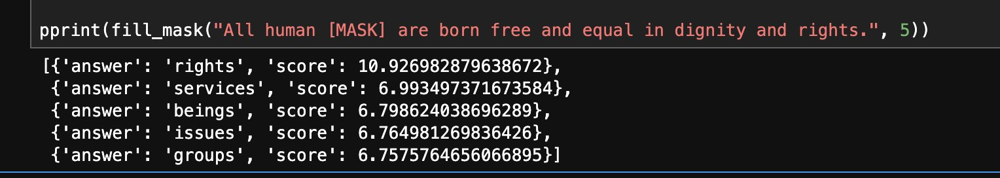
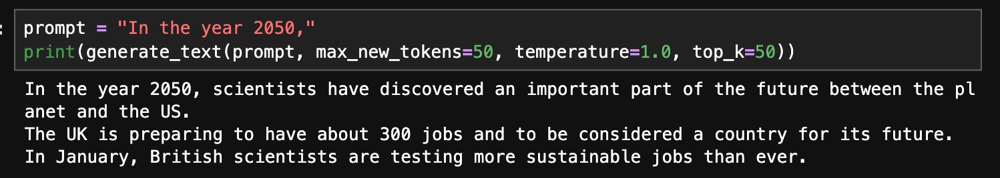

# attentif

A toy implementation of ”Attention Is All You Need”

## Demo

**BERT**

**GPT2**

## Motivation

I made this project in order to get a deeper understanding for the Transformer architecture, BERT, RoBERTa, T5, and GPT models. We often rely on existing Transformer implementation such as [Hugging Face Transformers](https://github.com/huggingface/transformers) when we need to train a model. However, I wanted to test if I can implement them from scratch, referring to the paper.

This project **does** include:
- `torch.nn.Module`
- `torch.nn.Parameter`
- Existing tokenizer implementation from `transformers`
- And other primitive functions offered by PyTorch

While this project **does not** include:
- Any models from `transformers`
- `nn.Transformer`
- `nn.MultiheadAttention`
- `nn.Embedding`
- `nn.LayerNorm`
- `nn.functional.softmax`
- And other existing modules that plays an essential role in Transformer architecture

## Features

We implemented the following features so far. You can find the layers and functions in `src/layers`, and models in `src/models`.

### Functions

- [x] `dropout`
- [x] `softmax`
- [ ] `gelu`
- [x] `positional_encoding`

### Layers

- [x] `MultiHeadAttention`
- [x] `FeedForwardNetwork`
- [x] `LayerNorm`
- [x] `TokenEmbedding`
- [x] `TransformerEncoder`
- [x] `TransformerEncoderBlock`
- [x] `TransformerDecoder`
- [x] `TransformerDecoderBlock`

### Models

- [x] `BertModel`
- [x] `GPT2Model`
- [ ] `T5Model`

### Schedulers

We use `transformers` for schedulers for now, but have a plan to implement them from scratch in the future.

- [ ] `AdamW`
- [x] `CrossEntropy`

## References

- Vaswani, A., Shazeer, N., Parmar, N., Uszkoreit, J., Jones, L., Gomez, A. N., Kaiser, Ł., & Polosukhin, I. (2017). [Attention is All You Need](https://arxiv.org/abs/1706.03762). NeurIPS 2017.
- Devlin, J., Chang, M. W., Lee, K., & Toutanova, K. (2018). [BERT: Pre-training of Deep Bidirectional Transformers for Language Understanding](https://arxiv.org/abs/1810.04805). NAACL 2019.
- Radford, A., Wu, J., Child, R., Luan, D., Amodei, D., & Sutskever, I. (2019). [Language Models are Unsupervised Multitask Learners](https://cdn.openai.com/better-language-models/language_models_are_unsupervised_multitask_learners.pdf). OpenAI.

