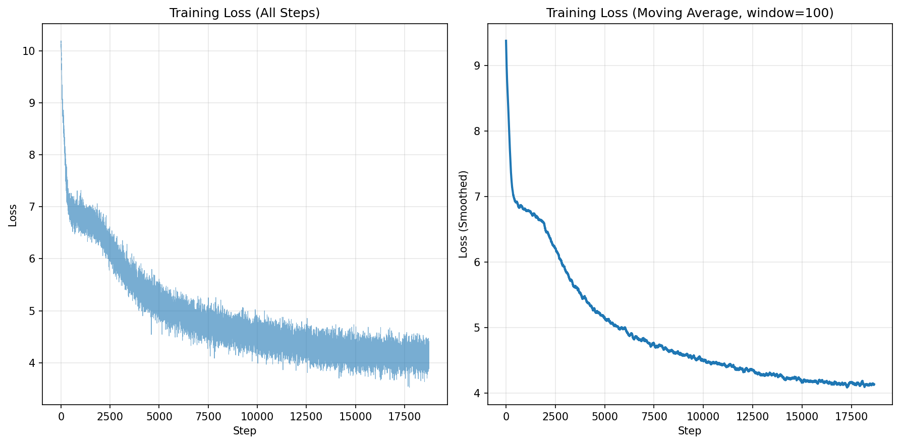

# attentif

A toy implementation of ”Attention Is All You Need”

## Demo

### [BERT (Devlin et al., 2018)](https://arxiv.org/abs/1810.04805)

## Motivation

I made this project in order to get a deeper understainding for the Transformer architecture, BERT, RoBERTa, T5, and GPT models. We often rely on existing Transformer implementation when we need to train a model, but I wanted to test if I can implement them from scratch, referring to the paper.

This project does include:
- `torch.nn.Module`
- `torch.nn.Parameter`
- and other primitive functions offered by PyTorch

While this project does not include:
- `transformers`
- `nn.Transformer`
- `nn.MultiHeadAttention`
- `nn.Embedding`
- `nn.LayerNorm`
- `nn.functional.softmax`
- and other existing modules that takes an essential role in Transformer architecture

## Features

We implemented the following features so far. You can find the layers and functions in `src/layers`, and models in `src/models`.

### Functions

- [x] `dropout`
- [x] `softmax`
- [x] `relu`
- [ ] `gelu`
- [x] `positional_encoding`

### Layers

- [x] `MultiHeadAttention`
- [x] `FeedForwardNetwork`
- [x] `LayerNorm`
- [x] `TokenEmbedding`
- [x] `TransformerEncoder`
- [x] `TransformerEncoderBlock`
- [ ] `TransformerDecoder`
- [ ] `TransformerDecoderBlock`

### Models

- [x] `BertModel`
- [ ] `Gpt2Model`
- [ ] `T5Model`
